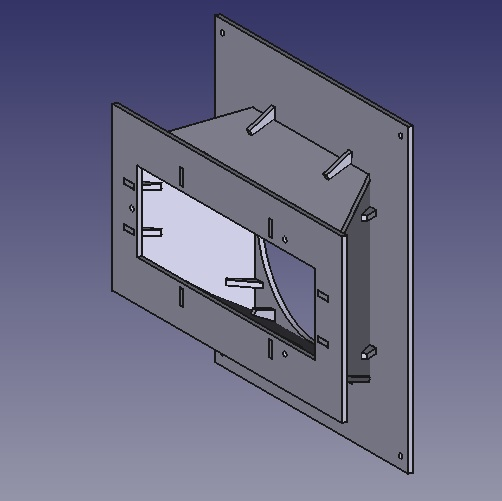

  <a href="./disenos.html" style="text-decoration: none;">
    <button style="padding: 10px 20px; margin: 5px; background-color: #008CBA; color: white; border: none; border-radius: 5px;">Diseños</button>
  </a>
  <a href="./descargas.html" style="text-decoration: none;">
    <button style="padding: 10px 20px; margin: 5px; background-color: #33BFFF; color: white; border: none; border-radius: 5px;">Descargas</button>
  </a>
  <a href="./contacto.html" style="text-decoration: none;">
    <button style="padding: 10px 20px; margin: 5px; background-color: #008CBA; color: white; border: none; border-radius: 5px;">Contacto</button>
  </a>

### Fan Adapter
 

<a href="files/fan_adapter/fan_adapter.zip" download>Descargar</a>